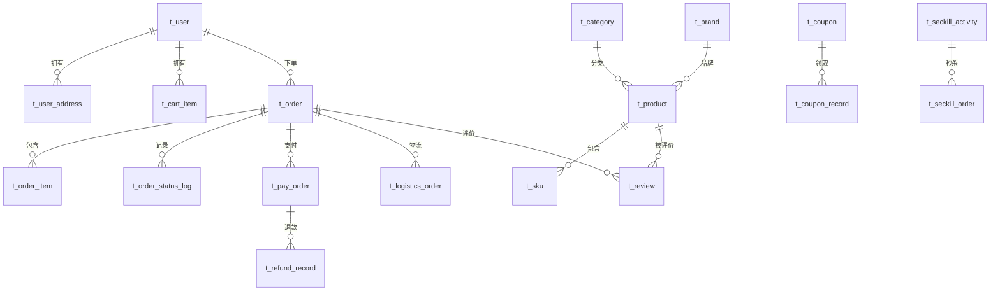

# 数据库设计

## 概览
项目共 8 个数据库，每个微服务独立一个库：

| 数据库 | 对应服务 | 表数量 | 说明 |
|--------|---------|--------|------|
| byw_user | byw-user | 3 | 用户中心 |
| byw_product | byw-product | 4 | 商品中心 |
| byw_cart | byw-cart | 1 | 购物车 |
| byw_order | byw-order | 3 | 订单中心 |
| byw_pay | byw-pay | 2 | 支付中心 |
| byw_logistics | byw-logistics | 2 | 物流中心 |
| byw_review | byw-review | 2 | 评价系统 |
| byw_promotion | byw-promotion | 5 | 营销中心 |

## ER 关系图

## 各库表结构详解

### byw_user

#### t_user（用户主表）

| 字段 | 类型 | 说明 |
|------|------|------|
| id | BIGINT | 主键 |
| username | VARCHAR | 用户名 |
| password | VARCHAR | 密码 |
| phone | VARCHAR | 手机号 |
| email | VARCHAR | 邮箱 |
| nickname | VARCHAR | 昵称 |
| avatar | VARCHAR | 头像 |
| gender | TINYINT | 性别（0未知 1男 2女） |
| status | TINYINT | 状态（0禁用 1正常） |
| user_level | TINYINT | 用户等级（0普通 1银卡 2金卡 3钻石） |
| created_at | DATETIME | 创建时间 |
| updated_at | DATETIME | 更新时间 |
| deleted | TINYINT | 逻辑删除 |

索引：`idx_phone`、`idx_username`

#### t_user_address（收货地址）

| 字段 | 类型 | 说明 |
|------|------|------|
| id | BIGINT | 主键 |
| user_id | BIGINT | 用户ID |
| receiver_name | VARCHAR | 收件人姓名 |
| receiver_phone | VARCHAR | 收件人手机号 |
| province | VARCHAR | 省 |
| city | VARCHAR | 市 |
| district | VARCHAR | 区 |
| detail_address | VARCHAR | 详细地址 |
| is_default | TINYINT | 是否默认地址 |
| created_at | DATETIME | 创建时间 |
| updated_at | DATETIME | 更新时间 |
| deleted | TINYINT | 逻辑删除 |

索引：`idx_user_id`

#### t_user_level（用户等级）

| 字段 | 类型 | 说明 |
|------|------|------|
| id | BIGINT | 主键 |
| level_name | VARCHAR | 等级名称 |
| level_code | INT | 等级编码 |
| discount_rate | DECIMAL | 折扣率 |
| min_points | INT | 最低积分 |
| created_at | DATETIME | 创建时间 |

初始数据：

| level_name | level_code | discount_rate | min_points |
|------------|-----------|---------------|------------|
| 普通用户 | 0 | 1.00 | 0 |
| 银卡 | 1 | 0.95 | 1000 |
| 金卡 | 2 | 0.90 | 5000 |
| 钻石 | 3 | 0.85 | 20000 |

### byw_product

#### t_category（商品分类）

| 字段 | 类型 | 说明 |
|------|------|------|
| id | BIGINT | 主键 |
| name | VARCHAR | 分类名称 |
| parent_id | BIGINT | 父分类ID |
| level | INT | 层级 |
| sort_order | INT | 排序 |
| icon | VARCHAR | 图标 |
| is_show | TINYINT | 是否显示 |
| created_at | DATETIME | 创建时间 |
| updated_at | DATETIME | 更新时间 |
| deleted | TINYINT | 逻辑删除 |

#### t_brand（品牌）

| 字段 | 类型 | 说明 |
|------|------|------|
| id | BIGINT | 主键 |
| name | VARCHAR | 品牌名称 |
| logo | VARCHAR | 品牌Logo |
| sort_order | INT | 排序 |
| created_at | DATETIME | 创建时间 |
| updated_at | DATETIME | 更新时间 |
| deleted | TINYINT | 逻辑删除 |

#### t_product（SPU主表）

| 字段 | 类型 | 说明 |
|------|------|------|
| id | BIGINT | 主键 |
| name | VARCHAR | 商品名称 |
| subtitle | VARCHAR | 副标题 |
| category_id | BIGINT | 分类ID |
| brand_id | BIGINT | 品牌ID |
| main_image | VARCHAR | 主图 |
| sub_images | VARCHAR | 副图 |
| detail_html | TEXT | 详情HTML |
| status | TINYINT | 状态（0草稿 1上架 2下架） |
| sales_count | INT | 销量 |
| created_at | DATETIME | 创建时间 |
| updated_at | DATETIME | 更新时间 |
| deleted | TINYINT | 逻辑删除 |

#### t_sku（SKU规格表）

| 字段 | 类型 | 说明 |
|------|------|------|
| id | BIGINT | 主键 |
| product_id | BIGINT | 商品ID |
| sku_code | VARCHAR | SKU编码 |
| sku_name | VARCHAR | SKU名称 |
| spec_data | JSON | 规格数据 |
| price | DECIMAL | 价格 |
| cost_price | DECIMAL | 成本价 |
| stock | INT | 库存 |
| lock_stock | INT | 锁定库存 |
| image | VARCHAR | 图片 |
| weight | DECIMAL | 重量 |
| status | TINYINT | 状态 |
| created_at | DATETIME | 创建时间 |
| updated_at | DATETIME | 更新时间 |
| deleted | TINYINT | 逻辑删除 |

### byw_cart

#### t_cart_item

| 字段 | 类型 | 说明 |
|------|------|------|
| id | BIGINT | 主键 |
| user_id | BIGINT | 用户ID |
| sku_id | BIGINT | SKU ID |
| product_id | BIGINT | 商品ID |
| sku_name | VARCHAR | SKU名称 |
| product_image | VARCHAR | 商品图片 |
| quantity | INT | 数量 |
| price | DECIMAL | 单价 |
| selected | TINYINT | 是否选中 |
| created_at | DATETIME | 创建时间 |
| updated_at | DATETIME | 更新时间 |
| deleted | TINYINT | 逻辑删除 |

唯一索引：`uk_user_sku(user_id, sku_id)`

### byw_order

#### t_order（订单主表）

| 字段 | 类型 | 说明 |
|------|------|------|
| id | BIGINT | 主键 |
| order_no | VARCHAR | 订单号 |
| user_id | BIGINT | 用户ID |
| total_amount | DECIMAL | 总金额 |
| pay_amount | DECIMAL | 实付金额 |
| freight_amount | DECIMAL | 运费 |
| discount_amount | DECIMAL | 优惠金额 |
| coupon_id | BIGINT | 优惠券ID |
| status | TINYINT | 状态（0待付款 1待发货 2待收货 3已完成 4已取消 5退款中 6已退款） |
| receiver_name | VARCHAR | 收件人 |
| receiver_phone | VARCHAR | 收件人电话 |
| receiver_address | VARCHAR | 收件地址 |
| remark | VARCHAR | 备注 |
| pay_time | DATETIME | 支付时间 |
| ship_time | DATETIME | 发货时间 |
| receive_time | DATETIME | 收货时间 |
| cancel_time | DATETIME | 取消时间 |
| cancel_reason | VARCHAR | 取消原因 |
| created_at | DATETIME | 创建时间 |
| updated_at | DATETIME | 更新时间 |
| deleted | TINYINT | 逻辑删除 |

#### t_order_item（订单明细）

| 字段 | 类型 | 说明 |
|------|------|------|
| id | BIGINT | 主键 |
| order_id | BIGINT | 订单ID |
| order_no | VARCHAR | 订单号 |
| user_id | BIGINT | 用户ID |
| product_id | BIGINT | 商品ID |
| sku_id | BIGINT | SKU ID |
| product_name | VARCHAR | 商品名称 |
| sku_name | VARCHAR | SKU名称 |
| product_image | VARCHAR | 商品图片 |
| price | DECIMAL | 单价 |
| quantity | INT | 数量 |
| subtotal | DECIMAL | 小计 |
| created_at | DATETIME | 创建时间 |

#### t_order_status_log（状态变更日志）

| 字段 | 类型 | 说明 |
|------|------|------|
| id | BIGINT | 主键 |
| order_id | BIGINT | 订单ID |
| from_status | TINYINT | 原状态 |
| to_status | TINYINT | 新状态 |
| operator | VARCHAR | 操作人 |
| remark | VARCHAR | 备注 |
| created_at | DATETIME | 创建时间 |

### byw_pay

#### t_pay_order（支付单）

| 字段 | 类型 | 说明 |
|------|------|------|
| id | BIGINT | 主键 |
| pay_no | VARCHAR | 支付单号 |
| order_no | VARCHAR | 订单号 |
| user_id | BIGINT | 用户ID |
| amount | DECIMAL | 金额 |
| pay_channel | VARCHAR | 支付渠道 |
| status | TINYINT | 状态（0待支付 1支付成功 2支付失败 3已退款） |
| channel_trade_no | VARCHAR | 渠道交易号 |
| pay_time | DATETIME | 支付时间 |
| callback_content | TEXT | 回调内容 |
| created_at | DATETIME | 创建时间 |
| updated_at | DATETIME | 更新时间 |
| deleted | TINYINT | 逻辑删除 |

#### t_refund_record（退款记录）

| 字段 | 类型 | 说明 |
|------|------|------|
| id | BIGINT | 主键 |
| refund_no | VARCHAR | 退款单号 |
| pay_no | VARCHAR | 支付单号 |
| order_no | VARCHAR | 订单号 |
| user_id | BIGINT | 用户ID |
| refund_amount | DECIMAL | 退款金额 |
| reason | VARCHAR | 退款原因 |
| status | TINYINT | 状态（0处理中 1成功 2失败） |
| created_at | DATETIME | 创建时间 |
| updated_at | DATETIME | 更新时间 |
| deleted | TINYINT | 逻辑删除 |

### byw_logistics

#### t_logistics_order（物流单）

| 字段 | 类型 | 说明 |
|------|------|------|
| id | BIGINT | 主键 |
| order_no | VARCHAR | 订单号 |
| company_code | VARCHAR | 物流公司编码 |
| company_name | VARCHAR | 物流公司名称 |
| tracking_no | VARCHAR | 运单号 |
| sender_name | VARCHAR | 寄件人 |
| sender_phone | VARCHAR | 寄件人电话 |
| sender_address | VARCHAR | 寄件地址 |
| receiver_name | VARCHAR | 收件人 |
| receiver_phone | VARCHAR | 收件人电话 |
| receiver_address | VARCHAR | 收件地址 |
| status | TINYINT | 状态（0已揽收 1运输中 2派送中 3已签收） |
| created_at | DATETIME | 创建时间 |
| updated_at | DATETIME | 更新时间 |
| deleted | TINYINT | 逻辑删除 |

#### t_logistics_trace（物流轨迹）

| 字段 | 类型 | 说明 |
|------|------|------|
| id | BIGINT | 主键 |
| logistics_id | BIGINT | 物流单ID |
| tracking_no | VARCHAR | 运单号 |
| description | VARCHAR | 描述 |
| location | VARCHAR | 位置 |
| trace_time | DATETIME | 轨迹时间 |
| created_at | DATETIME | 创建时间 |

### byw_review

#### t_review（评价）

| 字段 | 类型 | 说明 |
|------|------|------|
| id | BIGINT | 主键 |
| order_no | VARCHAR | 订单号 |
| user_id | BIGINT | 用户ID |
| product_id | BIGINT | 商品ID |
| sku_id | BIGINT | SKU ID |
| rating | TINYINT | 评分（1-5星） |
| content | TEXT | 评价内容 |
| has_image | TINYINT | 是否有图 |
| is_anonymous | TINYINT | 是否匿名 |
| status | TINYINT | 状态（0隐藏 1显示） |
| created_at | DATETIME | 创建时间 |
| updated_at | DATETIME | 更新时间 |
| deleted | TINYINT | 逻辑删除 |

#### t_review_image（评价图片）

| 字段 | 类型 | 说明 |
|------|------|------|
| id | BIGINT | 主键 |
| review_id | BIGINT | 评价ID |
| image_url | VARCHAR | 图片URL |
| type | TINYINT | 类型（0初评 1追评） |
| created_at | DATETIME | 创建时间 |

### byw_promotion

#### t_coupon（优惠券模板）

| 字段 | 类型 | 说明 |
|------|------|------|
| id | BIGINT | 主键 |
| name | VARCHAR | 优惠券名称 |
| type | TINYINT | 类型（1满减 2折扣 3无门槛） |
| discount_value | DECIMAL | 优惠值 |
| min_amount | DECIMAL | 最低消费 |
| total_count | INT | 总数量 |
| claimed_count | INT | 已领取数量 |
| start_time | DATETIME | 开始时间 |
| end_time | DATETIME | 结束时间 |
| status | TINYINT | 状态 |
| created_at | DATETIME | 创建时间 |
| updated_at | DATETIME | 更新时间 |
| deleted | TINYINT | 逻辑删除 |

#### t_coupon_record（领取记录）

| 字段 | 类型 | 说明 |
|------|------|------|
| id | BIGINT | 主键 |
| coupon_id | BIGINT | 优惠券ID |
| user_id | BIGINT | 用户ID |
| order_no | VARCHAR | 订单号 |
| status | TINYINT | 状态（0未使用 1已使用 2已过期） |
| used_time | DATETIME | 使用时间 |
| created_at | DATETIME | 创建时间 |

#### t_seckill_activity（秒杀活动）

| 字段 | 类型 | 说明 |
|------|------|------|
| id | BIGINT | 主键 |
| name | VARCHAR | 活动名称 |
| product_id | BIGINT | 商品ID |
| sku_id | BIGINT | SKU ID |
| seckill_price | DECIMAL | 秒杀价 |
| total_stock | INT | 总库存 |
| available_stock | INT | 可用库存 |
| start_time | DATETIME | 开始时间 |
| end_time | DATETIME | 结束时间 |
| status | TINYINT | 状态（0未开始 1进行中 2已结束） |
| created_at | DATETIME | 创建时间 |
| updated_at | DATETIME | 更新时间 |
| deleted | TINYINT | 逻辑删除 |

#### t_seckill_order（秒杀订单）

| 字段 | 类型 | 说明 |
|------|------|------|
| id | BIGINT | 主键 |
| activity_id | BIGINT | 活动ID |
| user_id | BIGINT | 用户ID |
| order_no | VARCHAR | 订单号 |
| status | TINYINT | 状态（0待支付 1已支付 2已取消） |
| created_at | DATETIME | 创建时间 |

唯一索引：`uk_activity_user(activity_id, user_id)` — 防重复秒杀

#### t_group_buy_activity（拼团活动）

| 字段 | 类型 | 说明 |
|------|------|------|
| id | BIGINT | 主键 |
| name | VARCHAR | 活动名称 |
| product_id | BIGINT | 商品ID |
| group_price | DECIMAL | 拼团价 |
| original_price | DECIMAL | 原价 |
| group_size | INT | 成团人数 |
| max_groups | INT | 最大团数 |
| start_time | DATETIME | 开始时间 |
| end_time | DATETIME | 结束时间 |
| status | TINYINT | 状态 |
| created_at | DATETIME | 创建时间 |
| updated_at | DATETIME | 更新时间 |
| deleted | TINYINT | 逻辑删除 |
