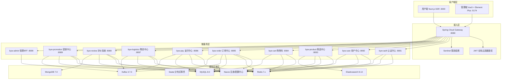
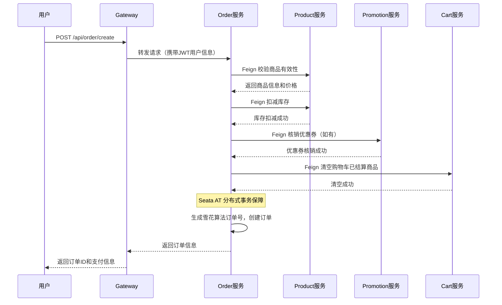
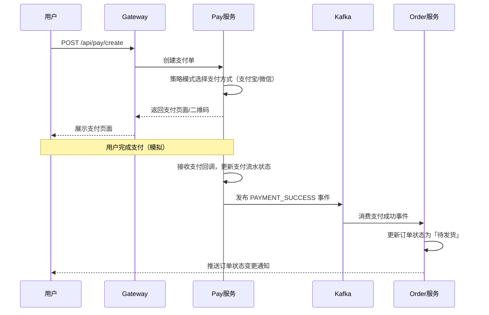
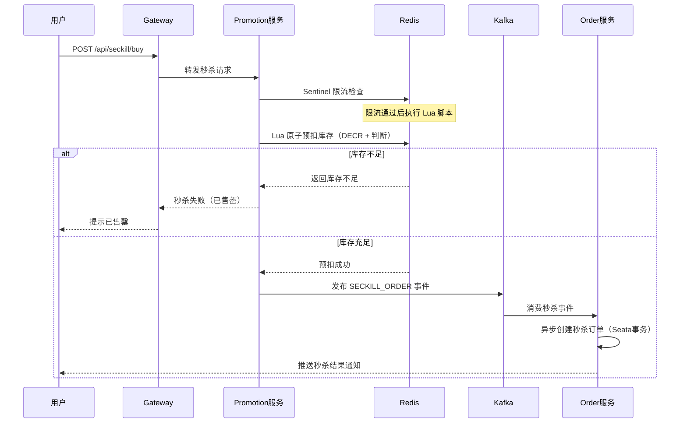

# 系统架构

## 整体架构图

## 微服务划分

| 服务名 | 端口 | 职责 | 依赖中间件 |
|--------|------|------|-----------|
| byw-gateway | 8080 | API 网关路由、JWT 鉴权、限流 | Nacos, Redis, Sentinel |
| byw-auth | 8081 | 注册、登录、Token 签发与刷新 | MySQL, Redis, Nacos |
| byw-user | 8082 | 用户 CRUD、收货地址、会员等级 | MySQL, Redis, Nacos |
| byw-product | 8083 | 分类/品牌/SPU-SKU 管理、库存、ES 搜索 | MySQL, Redis, ES, Nacos |
| byw-cart | 8084 | 购物车增删改查、结算 | MySQL, Redis, Nacos |
| byw-order | 8085 | 订单创建、状态机、超时取消、Seata 事务 | MySQL, Redis, Kafka, Seata, Nacos |
| byw-pay | 8086 | 支付策略、模拟回调、支付流水 | MySQL, Redis, Kafka, Nacos |
| byw-logistics | 8087 | 发货管理、物流跟踪、状态更新 | MySQL, Kafka, Nacos |
| byw-review | 8088 | 评价管理、评分统计 | MySQL, MongoDB, Redis, Nacos |
| byw-promotion | 8089 | 优惠券、秒杀（Lua预扣+限流）、拼团 | MySQL, Redis, Kafka, Nacos |
| byw-admin | 8090 | 管理后台 BFF 聚合层 | Nacos |
| byw-common | — | 公共工具模块（8 个子模块） | — |

## 服务间通信

### 同步调用（OpenFeign）
通过 `byw-api` 模块定义 Feign 接口和 DTO，各服务声明式调用其他服务接口，适合需要实时响应的场景：
- Order → Product（校验商品、扣减库存）
- Order → Cart（清空已结算商品）
- Order → Promotion（核销优惠券）
- Admin → 各业务服务（聚合查询）

### 异步调用（Kafka）
通过 Kafka 发布/订阅事件，实现跨服务最终一致性和削峰填谷：
- **支付成功** → Pay 发送事件 → Order 更新状态为待发货
- **库存扣减** → Promotion 秒杀预扣 → Order 异步创建订单
- **物流状态变更** → Logistics 发送事件 → Order 更新物流状态
- **订单完成** → Order 发送事件 → Review 开放评价入口、Promotion 结算优惠券

## 核心业务流程

### 1. 下单流程

### 2. 支付流程

### 3. 秒杀流程

## Gateway 路由规则

| 路径前缀 | 目标服务 | 备注 |
|---------|---------|------|
| `/api/admin/auth/**` | byw-auth | StripPrefix=2，`/api/admin/auth/login` → `/auth/login` |
| `/api/admin/**` | byw-admin | 管理端 BFF，StripPrefix=1，`/api/admin/product/list` → `/admin/product/list` |
| `/api/auth/**` | byw-auth | StripPrefix=1 |
| `/api/user/**` | byw-user | StripPrefix=1 |
| `/api/product/**` | byw-product | StripPrefix=1 |
| `/api/category/**` | byw-product | StripPrefix=1 |
| `/api/search/**` | byw-product | StripPrefix=1 |
| `/api/brand/**` | byw-product | StripPrefix=1 |
| `/api/cart/**` | byw-cart | StripPrefix=1 |
| `/api/order/**` | byw-order | StripPrefix=1 |
| `/api/pay/**` | byw-pay | StripPrefix=1 |
| `/api/logistics/**` | byw-logistics | StripPrefix=1 |
| `/api/review/**` | byw-review | StripPrefix=1 |
| `/api/promotion/**` | byw-promotion | StripPrefix=1 |
| `/api/coupon/**` | byw-promotion | StripPrefix=1 |
| `/api/seckill/**` | byw-promotion | StripPrefix=1 |
